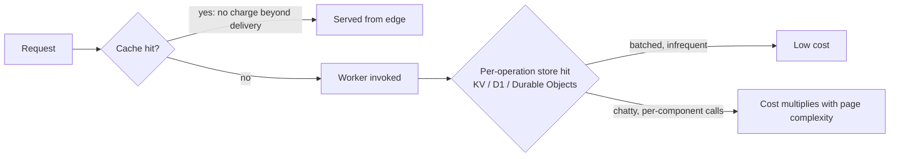

--8<-- "_snippets/disclaimer.md"

# Cost Optimization

Cost optimization on Cloudflare requires unlearning VM-hour intuition. There's no instance size to right-size, no reserved capacity to commit to, and mostly no idle compute burning money while it waits for traffic. Workers bill primarily on requests and CPU time consumed, not wall-clock duration; R2 has no egress fees; KV, D1, and Durable Objects each bill per operation with their own units.

This model is efficient by default for spiky, low-average-utilization workloads, but it has its own failure modes: it punishes chatty, high-frequency access against per-operation-billed stores, and makes it easy to quietly pay for Enterprise-tier capability (advanced WAF features, dedicated support, elevated limits) a workload never exercises.

Pricing tiers, quotas, and per-unit rates change over time, so this page deliberately doesn't hardcode numbers — check current values at the linked pricing pages before building a cost model.

Every request that stops at cache is free of Worker and origin cost; every uncached request's cost is driven by how many billed operations it triggers downstream — that's the lever this pillar is about pulling deliberately.

## Design principles

- **Understand what you're actually billed for before you design around it.** Workers [pricing](https://developers.cloudflare.com/workers/platform/pricing/) is based on requests and CPU time actually consumed, not wall-clock time waiting on I/O like a `fetch()`. A slow upstream call isn't charged for the wait; a CPU-heavy operation (JSON parsing, cryptography, templating) is charged regardless.
- **Match each data access pattern to the store priced for it.** R2's [no-egress-fee](https://developers.cloudflare.com/r2/) model beats S3-alike egress-billed storage for read-heavy or public-object workloads. KV is priced for infrequent writes and high read volume. Durable Objects bill for requests, duration, and storage — not the cheap option for high-frequency, low-value state a cache would handle for less.
- **Don't provision for Enterprise-tier capability you don't need.** Advanced WAF features, dedicated account management, and elevated limits carry cost. Audit which tier a workload actually needs against the requirement (usually Security or Reliability) that justifies it, rather than defaulting to the highest "to be safe."
- **Let caching absorb cost, not just latency.** Every request served from cache via [Cache Rules](https://developers.cloudflare.com/cache/how-to/cache-rules/) or [Tiered Cache](https://developers.cloudflare.com/cache/how-to/tiered-cache/) is one your origin — and often your Worker — never processes. Cache hit ratio is a cost lever, not just a performance one.
- **Model per-operation costs before they show up as chatty access patterns.** A Worker issuing a KV read or Durable Object call per sub-component instead of batching multiplies billed operations with page complexity — invisible locally, very visible on the invoice at scale.
- **Use free-tier and included-quota headroom deliberately during prototyping, then re-cost before production.** What's free at low volume isn't necessarily cheapest at production volume for every store — recheck the trade-off rather than assuming the architecture stays optimal as usage scales.

## Cloudflare capabilities for this pillar

| Capability | Cost-relevant behavior |
|---|---|
| [Workers pricing](https://developers.cloudflare.com/workers/platform/pricing/) | Billed on requests and CPU time; no charge for duration or egress bandwidth |
| [Workers limits](https://developers.cloudflare.com/workers/platform/limits/) | CPU time ceilings per invocation — understand these before assuming a design will simply "run longer" for more cost |
| [R2 pricing](https://developers.cloudflare.com/r2/pricing/) | Storage plus Class A (mutating) and Class B (reading) operations, with no egress bandwidth charges from R2 at all |
| [Workers KV](https://developers.cloudflare.com/kv/) | Priced for high-read, low-write access patterns; frequent per-request writes are the expensive case |
| [D1](https://developers.cloudflare.com/d1/) | Serverless SQLite billed for rows read/written and storage, with no idle compute charge between queries |
| [Durable Objects](https://developers.cloudflare.com/durable-objects/) | Billed for requests, duration, and storage — appropriate for coordination and stateful logic, not high-frequency low-value counters |
| [Queues](https://developers.cloudflare.com/queues/) | No egress charges; billed per operation, making it cost-effective for decoupling without a separate message broker to run |
| [Cache Rules](https://developers.cloudflare.com/cache/how-to/cache-rules/) / [Tiered Cache](https://developers.cloudflare.com/cache/how-to/tiered-cache/) | Higher cache hit ratios reduce both origin cost and, indirectly, Worker invocation volume |

## Common pitfalls

- **Using Durable Objects for high-frequency, low-value state** — a page-view counter, an ephemeral rate-limit tracker — that KV or the [Cache API](https://developers.cloudflare.com/workers/runtime-apis/cache/) would handle for less.
- **A Worker performing several KV or D1 reads per request when one batched read would do**, multiplying billed operations without adding user-facing value.
- **Provisioning Enterprise-tier WAF or support for a workload whose actual requirement is Business-tier**, because nobody re-evaluated the tier after initial rollout.
- **Ignoring CPU time limits during design, then finding a computation-heavy code path routinely approaches the ceiling in production** — cheap to catch in design review, expensive in an incident.
- **Skipping Tiered Cache or Cache Rules tuning "because origin is cheap"** — often true for the origin bill alone, false for the combined Worker-plus-origin bill once traffic scales.
- **Treating R2 as if it carries S3-style egress economics**, and building unnecessary caching or CDN layers in front of it to avoid a charge R2 egress doesn't have.

## Self-assessment questions

- Do you know, for this workload's dominant code paths, roughly how much CPU time each request consumes relative to per-invocation limits?
- For each stateful component, did you choose KV, D1, Durable Objects, or R2 based on its actual read/write ratio and consistency need, or by default?
- Are any Durable Objects used for high-frequency, low-value state that a cheaper primitive (KV, Cache API) would serve just as well?
- Have you audited your current plan tier against the specific feature that justifies it, rather than assuming higher is safer?
- Is your cache hit ratio tuned with Cache Rules and Tiered Cache to reduce both origin load and Worker invocation volume?
- Do you have visibility (via the GraphQL Analytics API or billing dashboards) into which operations or endpoints drive the largest share of cost?
- Did you re-cost this architecture's per-operation billing at expected production volume, not just prototype-scale free-tier usage?
- Are you relying on R2 where egress volume would have made S3-style storage meaningfully more expensive?

## Further reading

- [Workers pricing](https://developers.cloudflare.com/workers/platform/pricing/)
- [Workers limits](https://developers.cloudflare.com/workers/platform/limits/)
- [R2 pricing](https://developers.cloudflare.com/r2/pricing/)
- [R2 overview](https://developers.cloudflare.com/r2/)
- [Workers KV](https://developers.cloudflare.com/kv/)
- [D1 overview](https://developers.cloudflare.com/d1/)
- [Durable Objects](https://developers.cloudflare.com/durable-objects/)
- [Cloudflare Queues](https://developers.cloudflare.com/queues/)
- [Tiered Cache](https://developers.cloudflare.com/cache/how-to/tiered-cache/)
- [Cache Rules](https://developers.cloudflare.com/cache/how-to/cache-rules/)
