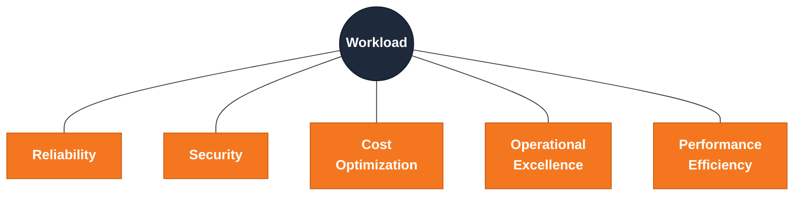

--8<-- "_snippets/disclaimer.md"

# Pillars Overview

Every workload built on Cloudflare can be evaluated through five lenses. None is optional, and none is free — improving one often costs you in another. Using all five deliberately makes those trade-offs a conscious design decision instead of an accident of whatever was easiest to ship.

## The five pillars

**[Reliability](reliability.md)** — Cloudflare's edge network is globally redundant by design, but your workload doesn't automatically inherit that. Origin, Durable Object jurisdiction, D1 primary location, and Queue consumer are all still single points of failure unless you architect around them with Load Balancing, health checks, and failover — or eliminate the dependency by moving state onto the edge.

**[Security](security.md)** — A Cloudflare workload gets defense in depth almost for free at the network edge (DDoS mitigation, WAF, bot management), but that's only the outer layer. Application-layer validation, least-privilege access via Zero Trust, and data protection at rest and in transit are still the workload owner's job.

**[Cost Optimization](cost-optimization.md)** — Workers bill on requests and CPU time, not VM-hours; R2 has no egress fees; KV, D1, and Durable Objects each have distinct per-operation pricing. This model punishes both over-provisioning (paying for Enterprise capability you don't use) and careless usage (chatty per-request reads against a store billed per-operation) in ways invisible until the invoice arrives.

**[Operational Excellence](operational-excellence.md)** — Infrastructure as code (Terraform), CI/CD (Wrangler, Workers Builds), and observability (Workers Logs, Tail Workers, Logpush, the GraphQL Analytics API) all exist in mature form on Cloudflare — but must be deliberately wired together. A default `wrangler deploy` from a laptop has none of it.

**[Performance Efficiency](performance-efficiency.md)** — The anycast network puts your Worker code close to every user by default, but the rest of the request path — origin calls, database reads, cache configuration — needs deliberate tuning with Smart Placement, Tiered Cache, Cache Rules, and the right data-locality choice between KV, D1, and Durable Objects. Otherwise the network's proximity advantage gets erased by a slow round trip you added yourself.

## Trade-offs between pillars

You can't maximize Reliability, Security, Cost Optimization, Operational Excellence, and Performance Efficiency simultaneously — they pull against each other. A good design makes the trade-off explicit rather than pretending it doesn't exist. Some recurring tensions:

| Tension | Why it happens |
|---|---|
| Reliability vs. Cost Optimization | Multi-origin Load Balancing, cross-region D1 read replicas, and redundant Queue consumers all cost more per request than a single origin and database. Extra redundancy means extra infrastructure and extra operations to run it. |
| Reliability vs. Performance Efficiency | A strongly consistent data path (a single Durable Object as source of truth) is easy to reason about and fail over cleanly, but it's anchored to one location — every request outside that region pays a longer round trip than an eventually consistent, globally replicated alternative like KV. |
| Security vs. Performance Efficiency | Every inspection layer — WAF managed rules, bot management, API schema validation — adds edge processing before a request reaches your Worker. Usually small and worthwhile, but not zero: aggressive rate limiting or challenge pages add friction for legitimate users. |
| Security vs. Operational Excellence | Zero Trust policies, mTLS between services, and tightly scoped API tokens beat a shared flat network and long-lived credentials — but add configuration surface that must be maintained, rotated, and kept in sync with team changes. |
| Cost Optimization vs. Operational Excellence | Full observability (Logpush to long-retention storage, Tail Workers sampling every request, a fully modeled Terraform estate) costs real engineering time and, for log storage, real money. Under-investing is cheap until the incident with no trace of what happened. |

When two pillars conflict for a specific workload, pick deliberately and record *why* — don't assume you can satisfy both. The [Design Review Checklist](../design-review-checklist.md) is a good place to write that reasoning down.

## Further reading

- [Cloudflare Reference Architecture library](https://developers.cloudflare.com/reference-architecture/)
- [Cloudflare network map](https://www.cloudflare.com/network/)
