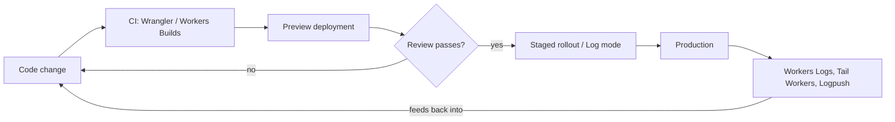

--8<-- "_snippets/disclaimer.md"

# Operational Excellence

Operational excellence on Cloudflare means treating Workers, R2 buckets, D1 databases, DNS, and WAF configuration as software: defined in code, deployed through a pipeline, observable in production, rolled out gradually rather than flipped on for everyone at once.

Cloudflare's tooling here is mature — a real Terraform provider, a real CLI with CI/CD integration, a real logging and analytics stack — but none of it is wired together by default. A team that only ever runs `wrangler deploy` from a laptop has working software with no operational scaffolding around it. That gap surfaces at the worst time: during an incident, or an unreviewed change that took down production.

Terraform-managed account/zone config (DNS, WAF, Load Balancing) follows the same loop in parallel — plan/review/apply instead of dashboard clicks, feeding the same observability layer.

## Design principles

- **Define Cloudflare resources as code, not dashboard clicks.** The [Terraform provider](https://developers.cloudflare.com/terraform/) can manage zones, DNS, WAF rules, Load Balancing, and more alongside the rest of your infrastructure. Dashboard changes not reflected in Terraform state drift silently, and are the first thing lost during an incident-driven emergency fix.
- **Put Worker deployment behind CI, not a developer's laptop.** [Workers Builds](https://developers.cloudflare.com/workers/ci-cd/builds/) connects a Worker directly to a GitHub or GitLab repo for automated builds, deployments, and preview URLs on push. Use it — or an equivalent [Wrangler](https://developers.cloudflare.com/workers/wrangler/) pipeline — so every production deployment traces back to a commit and a review.
- **Treat the Wrangler configuration file as a first-class, version-controlled artifact.** Current Wrangler versions support [`wrangler.jsonc`](https://developers.cloudflare.com/workers/wrangler/configuration/) as the recommended format (alongside legacy `wrangler.toml`). It belongs in the repository next to the code it configures — bindings, routes, and environment variables are part of the application, not deployment trivia.
- **Roll out risky changes gradually, not globally.** New Worker versions, WAF rules, and routing changes all support staged rollout. Use preview deployments and versioned rollouts for Workers, and test new WAF or rate-limiting rules in Log mode before switching to Block.
- **Instrument before you need it, not during the incident.** [Workers Logs](https://developers.cloudflare.com/workers/observability/), [Tail Workers](https://developers.cloudflare.com/workers/observability/logs/tail-workers/) for custom filtering and sampling, and [Logpush](https://developers.cloudflare.com/workers/observability/logs/logpush/) to a durable destination should all be configured before a workload takes production traffic — not after the first outage, with no data left to diagnose it.
- **Query your own operational data instead of only reading dashboards.** The [GraphQL Analytics API](https://developers.cloudflare.com/analytics/graphql-api/) exposes request, security, and performance data across products so you can build views dashboards don't offer. It's for observability, not billing reconciliation.

## Cloudflare capabilities for this pillar

| Capability | Role in Operational Excellence |
|---|---|
| [Terraform provider](https://developers.cloudflare.com/terraform/) | Infrastructure as code for zones, DNS, WAF, Load Balancing, and other account/zone-level configuration |
| [Wrangler CLI](https://developers.cloudflare.com/workers/wrangler/) | Build, test, and deploy Workers projects from the command line and from CI |
| [Wrangler configuration](https://developers.cloudflare.com/workers/wrangler/configuration/) | Version-controlled `wrangler.jsonc`/`wrangler.toml` defining bindings, routes, and environments |
| [Workers Builds](https://developers.cloudflare.com/workers/ci-cd/builds/) | Native GitHub/GitLab integration for automated builds, deployments, and preview URLs on push |
| [Workers Logs](https://developers.cloudflare.com/workers/observability/) | Automatic collection, filtering, and analysis of Worker logs in the dashboard |
| [Tail Workers](https://developers.cloudflare.com/workers/observability/logs/tail-workers/) | Custom filtering, sampling, and transformation of telemetry from producer Workers |
| [Logpush](https://developers.cloudflare.com/workers/observability/logs/logpush/) | Push Workers Trace Event Logs to R2, S3-compatible storage, or a logging provider for durable retention |
| [GraphQL Analytics API](https://developers.cloudflare.com/analytics/graphql-api/) | Query request, security, and performance data across products for custom dashboards and alerting |

## Common pitfalls

- **Manual dashboard changes to WAF rules, DNS, or Load Balancing that never get reflected back into Terraform**, so the next `terraform plan` either reverts the change or the state file no longer matches reality.
- **Deploying Workers straight from a developer machine with no CI step** — no consistent build, no required review, no reliable record of what's actually running in production.
- **Rolling a new WAF or rate-limiting rule straight to Block instead of Log mode first**, discovering false positives only after they've impacted users.
- **Standing up a Worker with no Logpush destination configured**, so log data only exists for the dashboard's short live-view window — by the time someone investigates yesterday's issue, the evidence is gone.
- **No Tail Worker or sampling strategy on a high-volume Worker**, so observability tooling either misses signal in the noise or costs more than necessary.
- **Treating `wrangler.toml`/`wrangler.jsonc` as disposable local config instead of a reviewed, version-controlled file** — bindings and routes changed outside a pull request are exactly what should be caught in review.

## Self-assessment questions

- Is every account- and zone-level resource that matters to this workload defined in Terraform, with no undocumented dashboard-only configuration?
- Does every production deployment go through CI, with no direct `wrangler deploy` from a developer machine?
- Is your Wrangler configuration file committed to version control and reviewed like any other code change?
- Do new WAF, bot, or rate-limiting rules go through a Log-mode observation period before enforce/block?
- Are Workers Logs, Tail Workers, and Logpush all configured before this workload takes production traffic, not added after the first incident?
- Can you reconstruct a specific past incident from Logpush data, or does your retention window not reach back far enough?
- Do you use the GraphQL Analytics API (or equivalent) to build operational visibility beyond the default dashboards?
- Is there a documented, exercised rollback path for a bad Worker deployment or WAF rule change?

## Further reading

- [Cloudflare Terraform provider](https://developers.cloudflare.com/terraform/)
- [Wrangler CLI](https://developers.cloudflare.com/workers/wrangler/)
- [Wrangler configuration](https://developers.cloudflare.com/workers/wrangler/configuration/)
- [Workers Builds](https://developers.cloudflare.com/workers/ci-cd/builds/)
- [Workers Observability](https://developers.cloudflare.com/workers/observability/)
- [Tail Workers](https://developers.cloudflare.com/workers/observability/logs/tail-workers/)
- [Workers Logpush](https://developers.cloudflare.com/workers/observability/logs/logpush/)
- [GraphQL Analytics API](https://developers.cloudflare.com/analytics/graphql-api/)
