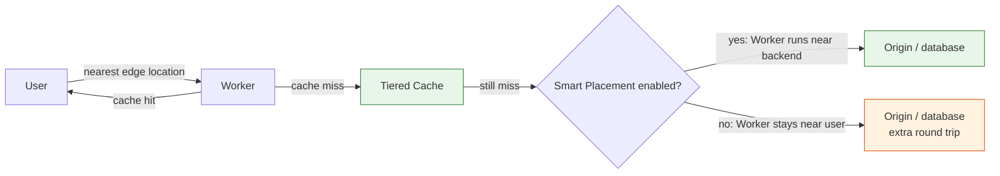

--8<-- "_snippets/disclaimer.md"

# Performance Efficiency

Performance efficiency on Cloudflare starts from an unusual advantage: your Worker's code already runs on an anycast network physically close to every user, no region selection required. That advantage is easy to erase by accident — a Worker close to the user but calling a single-region origin or database on every request just moves the latency problem one hop later. The user is close to the Worker; the Worker still isn't close to the data.

Performance efficiency here is mostly the discipline of tuning the rest of the request path — origin calls, data access, cache configuration — to exploit the network's placement, rather than assuming user proximity is the whole story.

## Design principles

- **Enable Smart Placement when your Worker's bottleneck is origin latency, not user latency.** [Smart Placement](https://developers.cloudflare.com/workers/configuration/smart-placement/) analyzes request duration across locations and, when a Worker primarily calls a single-region backend, runs the Worker closer to that backend instead of the user — eliminating redundant round trips for Workers making several sequential calls to the same origin or database.
- **Choose your data store based on the latency profile it actually produces, not just its feature set.** KV's [eventual consistency](https://developers.cloudflare.com/kv/concepts/how-kv-works/) trades a propagation delay (up to roughly a minute) for fast, globally distributed reads. Durable Objects and D1 give strong consistency anchored to a location — requests far from it pay real round-trip latency for correctness. Neither is universally "faster"; it depends on your read/write pattern and how far users sit from the anchor point.
- **Push caching as close to the request as the content allows.** [Cache Rules](https://developers.cloudflare.com/cache/how-to/cache-rules/) set what's eligible to cache and for how long. [Tiered Cache](https://developers.cloudflare.com/cache/how-to/tiered-cache/) cuts origin load further by having only a few upper-tier data centers ask the origin for content lower tiers lack, instead of every edge location hitting it independently.
- **Use Argo Smart Routing when the bottleneck is the network path to your origin, not the edge-to-user leg.** [Argo Smart Routing](https://developers.cloudflare.com/argo-smart-routing/) uses real-time network conditions to route origin-bound traffic around public-internet congestion — a different leg of the request than caching or Smart Placement, worth evaluating separately.
- **Don't default to the strongest consistency model out of caution when the workload can tolerate eventual consistency.** Reaching for Durable Objects or a strongly consistent database for data that's fine being a little stale (feature flags, configuration, non-critical counters) adds latency and anchoring cost for a guarantee the workload doesn't need.
- **Measure before and after any placement or caching change.** Cloudflare's analytics (Argo, cache, GraphQL Analytics API) show whether a change actually reduced latency or origin load for real traffic — don't assume a capability helps just because it's enabled.

## Cloudflare capabilities for this pillar

| Capability | Performance role |
|---|---|
| Cloudflare's anycast network | Runs Worker code at the location closest to each request by default, with no region configuration |
| [Smart Placement](https://developers.cloudflare.com/workers/configuration/smart-placement/) | Automatically relocates Worker execution closer to a Worker's dominant backend when that reduces total request duration |
| [Argo Smart Routing](https://developers.cloudflare.com/argo-smart-routing/) | Real-time congestion-aware routing of origin-bound traffic across the fastest available network path |
| [Tiered Cache](https://developers.cloudflare.com/cache/how-to/tiered-cache/) | Hierarchical caching across data center tiers to raise cache hit ratio and cut origin requests |
| [Cache Rules](https://developers.cloudflare.com/cache/how-to/cache-rules/) | Fine-grained control over cache eligibility, cache key, and edge TTL per route or request property |
| [Workers KV](https://developers.cloudflare.com/kv/) | Globally distributed, low-latency reads for data that can tolerate eventual consistency |
| [D1](https://developers.cloudflare.com/d1/) | SQLite at the edge with [read replication](https://developers.cloudflare.com/d1/best-practices/read-replication/) to reduce read latency close to users while preserving sequential consistency via the Sessions API |
| [Durable Objects](https://developers.cloudflare.com/durable-objects/) | Strongly consistent, low-latency state and coordination for data anchored to a single logical location |

## Common pitfalls

- **Not enabling Smart Placement for a Worker that primarily calls a single-region origin or database**, leaving every request to pay two long-haul round trips instead of one.
- **Using Durable Objects or D1 for data read far more often than it changes, and that would tolerate eventual consistency**, adding location-anchored latency for users far from the object when KV would serve the need faster and cheaper.
- **Leaving Cache Rules at defaults for genuinely cacheable content**, sending the origin traffic a wider eligibility rule or longer edge TTL would have absorbed entirely.
- **Assuming Tiered Cache and Argo Smart Routing solve the same problem.** Tiered Cache reduces how often the origin is asked for content already cached elsewhere; Argo optimizes the path for requests that must reach the origin. Skipping one because the other is enabled leaves a real gap.
- **Sharding Durable Objects by a key that concentrates most traffic on one instance** (one object per day instead of per user, say), turning a coordination primitive into an unintentional bottleneck.
- **Never re-measuring after enabling a performance feature**, so a Smart Placement or Argo change that isn't helping — or occasionally hurts unusual traffic patterns — stays on indefinitely.

## Self-assessment questions

- Have you evaluated Smart Placement for every Worker whose primary work is calling a single-region origin or database?
- For each data access pattern, did you choose KV, D1, or Durable Objects based on its actual latency and consistency trade-off — not by default?
- Is Cache Rules eligibility and TTL tuned deliberately for your cacheable routes, rather than left at platform defaults?
- Have you evaluated Tiered Cache topology (Smart, Regional, or Custom) against your origin's actual geographic footprint?
- If your origin-bound traffic crosses long network distances, have you evaluated Argo Smart Routing specifically for that leg of the request?
- Are your Durable Objects sharded by a key that distributes load evenly across instances rather than concentrating it?
- Do you have before/after latency measurements for the last performance-related configuration change you made?
- For D1 workloads using read replication, are you using the Sessions API correctly to get the consistency guarantee (read-your-writes, monotonic reads) your application actually needs?

## Further reading

- [Smart Placement](https://developers.cloudflare.com/workers/configuration/smart-placement/)
- [Argo Smart Routing](https://developers.cloudflare.com/argo-smart-routing/)
- [Tiered Cache](https://developers.cloudflare.com/cache/how-to/tiered-cache/)
- [Cache Rules](https://developers.cloudflare.com/cache/how-to/cache-rules/)
- [How Workers KV works](https://developers.cloudflare.com/kv/concepts/how-kv-works/)
- [D1 read replication and the Sessions API](https://developers.cloudflare.com/d1/best-practices/read-replication/)
- [Durable Objects](https://developers.cloudflare.com/durable-objects/)
