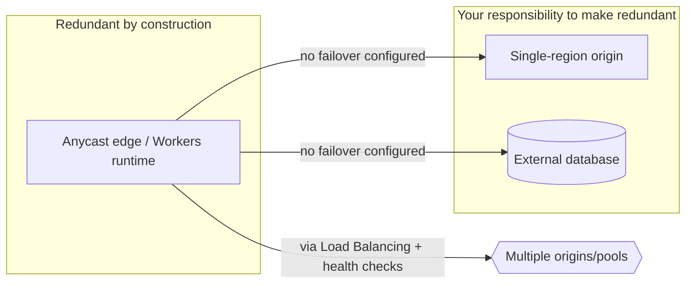

--8<-- "_snippets/disclaimer.md"

# Reliability

Reliability on Cloudflare splits into two problems. The network itself — the anycast edge terminating connections, running Workers, serving cached content — is globally redundant by construction: one data center failing or draining doesn't take the network down.

The second problem is everything *you* put behind or inside it: origin server, database, Durable Object, Queue consumer. None of it inherits the network's redundancy automatically — a Worker proxying every request to a single-region origin is only as reliable as that origin, no matter how many Cloudflare data centers front it.

Designing for reliability means knowing which parts live in the redundant, globally-distributed layer, and which are still a single dependency to protect — via failover, replication, or moving state onto the edge.

## Design principles

- **Don't assume your origin inherits the edge network's redundancy.** Put it behind [Load Balancing](https://developers.cloudflare.com/load-balancing/) with active health checks across multiple origins or providers, or remove it by moving state into Durable Objects, D1, or R2.
- **Pick your consistency model on purpose, not by default.** KV is fast and globally distributed but eventually consistent; Durable Objects and D1 are strongly consistent but anchored to a single location or primary. The wrong choice means either subtle correctness bugs or an avoidable single point of failure.
- **Treat a Durable Object's single-threaded design as a durability tool, not a bottleneck.** [Single-threaded, cooperatively multi-tasked](https://developers.cloudflare.com/durable-objects/what-are-durable-objects/) execution keeps in-memory state and storage race-free, but also makes one instance a single point of contention. Shard by a meaningful key (per-user, per-room, per-tenant), not one global object every request contends for.
- **Design for graceful degradation, not just failover.** A health check failover to a backup origin is necessary but not sufficient — decide up front what a degraded response looks like (stale cached content, a reduced feature set, a static fallback page) instead of leaving it to an uncaught exception.
- **Use Queues to decouple failure domains.** A synchronous call chain (Worker → origin → database) makes every link's downtime your downtime. Route non-latency-sensitive work through [Queues](https://developers.cloudflare.com/queues/) with retries and a dead-letter queue instead.
- **Plan for D1's replication topology explicitly.** Read replication improves read availability and latency, but writes still go through a primary — know where it lives and what happens to write availability if that region degrades.

## Cloudflare capabilities for this pillar

| Capability | How it serves Reliability |
|---|---|
| [Load Balancing](https://developers.cloudflare.com/load-balancing/) | Active health checks across multiple origins, with automatic failover and steering by latency, geography, or custom rules |
| [Durable Objects](https://developers.cloudflare.com/durable-objects/) | Strongly consistent, single-threaded coordination and storage without an external database, with [Alarms](https://developers.cloudflare.com/durable-objects/api/alarms/) for scheduled retry/cleanup logic |
| [D1](https://developers.cloudflare.com/d1/) | Serverless SQLite with [global read replication](https://developers.cloudflare.com/d1/best-practices/read-replication/) and [Time Travel](https://developers.cloudflare.com/d1/reference/time-travel/) point-in-time recovery |
| [R2](https://developers.cloudflare.com/r2/) | Durable object storage with built-in redundancy, removing a self-managed storage backend as a failure point |
| [Queues](https://developers.cloudflare.com/queues/) | Guaranteed delivery with batching, retries, and dead-letter queues to isolate downstream failures from the request path |
| [Cache Rules](https://developers.cloudflare.com/cache/how-to/cache-rules/) | Serving cached content as a degraded-but-available fallback when an origin is unhealthy |
| [Workers KV](https://developers.cloudflare.com/kv/) | Globally distributed reads for configuration/state that can tolerate eventual consistency, removing origin round trips as a dependency |

## Common pitfalls

- **A Worker that's just a thin proxy to one origin, with no Load Balancing or health checks.** Its global reach gives a false sense of resilience the architecture doesn't have.
- **Treating Durable Objects as inherently multi-region.** An instance is anchored to one location; a truly global, latency-sensitive access pattern can turn one heavily-contended instance into both bottleneck and single point of failure.
- **Using KV for state that needs read-your-own-write consistency.** Its up-to-60-second propagation window (see [how KV works](https://developers.cloudflare.com/kv/concepts/how-kv-works/)) is fine for config and cache-like data, but produces real bugs for a session or inventory count.
- **No dead-letter queue configured on a Queue.** Repeatedly failing messages then either retry forever or silently drop — discovered during an incident, not during design.
- **Assuming D1's primary region never changes availability characteristics.** If write throughput is latency- or availability-sensitive, know where the primary lives and your Sessions API bookmark strategy for read-after-write correctness.
- **No tested fallback for an origin outage.** Load Balancing failover is configured, but nobody has verified what the failed-over experience actually looks like.

## Self-assessment questions

- Does every origin-dependent Worker sit behind Load Balancing with active health checks against at least two independent origins?
- For each piece of application state, did you choose KV, D1, or Durable Objects based on its actual consistency requirement — not whichever was easiest to wire up?
- Is Durable Object sharding keyed by a dimension (user, tenant, room) that avoids concentrating all traffic on one instance?
- Do your Queues have a dead-letter queue configured, with an owner and a runbook for messages that land there?
- Have you tested what a user actually experiences during an origin failover, not just confirmed the health check fires?
- If D1's primary region became unavailable, do you know the actual impact on writes — and is that impact acceptable for this workload?
- Is there a defined degraded-mode response (cached content, reduced functionality, static fallback) for your critical user journeys?
- Are Time Travel or equivalent point-in-time recovery windows sufficient for your data-loss tolerance?

## Further reading

- [Cloudflare Load Balancing](https://developers.cloudflare.com/load-balancing/)
- [Durable Objects: what they are](https://developers.cloudflare.com/durable-objects/what-are-durable-objects/)
- [Durable Objects Alarms](https://developers.cloudflare.com/durable-objects/api/alarms/)
- [D1 overview](https://developers.cloudflare.com/d1/)
- [D1 read replication and the Sessions API](https://developers.cloudflare.com/d1/best-practices/read-replication/)
- [How Workers KV works](https://developers.cloudflare.com/kv/concepts/how-kv-works/)
- [Cloudflare Queues](https://developers.cloudflare.com/queues/)
- [Cache Rules](https://developers.cloudflare.com/cache/how-to/cache-rules/)
