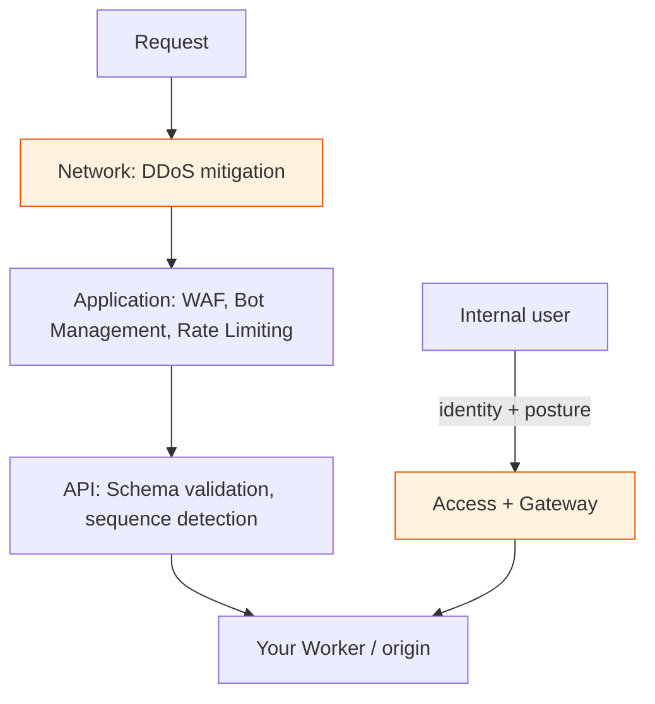

--8<-- "_snippets/disclaimer.md"

# Security

Security for a Cloudflare workload is a layered problem, and the layers map cleanly onto Cloudflare's product boundaries:

- **Network** — protection before traffic reaches your code.
- **Application** — protection at the edge, in front of your Worker.
- **Zero Trust** — governs how people and services reach anything not meant to be public.
- **Data protection** — what happens to bytes at rest and in transit, regardless of which layer let the request through.

The mistake is treating any one layer as sufficient alone. Automatic DDoS mitigation says nothing about whether your Worker validates its own input; a solid WAF config says nothing about an engineer SSHing into a database from an open corporate network.

## Design principles

- **Assume network-layer protection is a given, not a differentiator.** DDoS mitigation is active by default at the edge. What actually differentiates a workload's security posture is one layer up: WAF rule selection, bot handling, rate limits, and what the application does with a request once it arrives.
- **Push authentication and authorization to the edge wherever the workload allows it.** Validate a JWT or session in a Worker before invoking any backend, or gate access entirely with [Cloudflare Access](https://developers.cloudflare.com/cloudflare-one/policies/access/), so unauthenticated traffic never reaches billed compute or your data layer.
- **Replace flat network trust with identity-based access for anything internal.** Internal admin panels, staging, and service-to-service calls should go through [Access](https://developers.cloudflare.com/cloudflare-one/policies/access/) and [Cloudflare Tunnel](https://developers.cloudflare.com/cloudflare-one/networks/connectors/cloudflare-tunnel/) instead of a VPN or IP allowlist — a Tunnel means the origin never has a public IP to attack.
- **Treat schema and sequence validation as part of API security, not an add-on.** [API Shield](https://developers.cloudflare.com/api-shield/) validates requests against a real OpenAPI schema and detects abusive sequences a generic WAF rule would miss — a "valid-looking" request hitting endpoints in the wrong order is a business-logic attack, not a signature match.
- **Don't rely on obscurity for bot mitigation; use scoring.** Simple challenge pages stop unsophisticated scrapers, but a workload that depends on excluding automated traffic (ticketing, inventory, credential-stuffing-prone logins) needs [Bot Management](https://developers.cloudflare.com/bots/)'s per-request scoring — a Custom Rule alone can't replicate it.
- **Encrypt and scope everything, including internal traffic.** TLS to the origin (not just the edge), mTLS between services where [API Shield's mTLS](https://developers.cloudflare.com/api-shield/security/mtls/) applies, and narrowly scoped API tokens instead of one account-wide key — all cheap relative to the blast radius they prevent.

## Cloudflare capabilities for this pillar

| Layer | Capability |
|---|---|
| Network | Cloudflare's network-level DDoS mitigation, active on all proxied traffic |
| Application (WAF) | [WAF managed rulesets](https://developers.cloudflare.com/waf/managed-rules/) and [Custom Rules](https://developers.cloudflare.com/waf/custom-rules/) for known and workload-specific threats |
| Application (rate limiting) | [Rate Limiting Rules](https://developers.cloudflare.com/waf/rate-limiting-rules/) to cap abusive request volume per endpoint |
| Application (bots) | [Cloudflare bot solutions](https://developers.cloudflare.com/bots/) — Bot Fight Mode, Super Bot Fight Mode, and Bot Management with per-request scoring for Enterprise |
| Application (API) | [API Shield](https://developers.cloudflare.com/api-shield/) — schema validation, API discovery, sequence-based abuse detection, and mTLS |
| Application (client-side) | [Client-Side Security](https://developers.cloudflare.com/page-shield/) (formerly Page Shield) — monitoring for malicious or compromised third-party JavaScript |
| Internal access | [Cloudflare Access](https://developers.cloudflare.com/cloudflare-one/policies/access/) for identity-based application access, [Gateway](https://developers.cloudflare.com/cloudflare-one/policies/gateway/) for outbound traffic filtering, [Tunnel](https://developers.cloudflare.com/cloudflare-one/networks/connectors/cloudflare-tunnel/) to remove public IPs from origins, the [Cloudflare One Client](https://developers.cloudflare.com/cloudflare-one/team-and-resources/devices/cloudflare-one-client/) (formerly branded WARP) for device-level enrollment into Zero Trust policy |
| Data protection | TLS everywhere, R2 and D1 encryption at rest, scoped API tokens instead of global keys |

## Common pitfalls

- **A public-facing admin route protected only by an obscure URL.** Reachable without going through Access means unprotected — use Zero Trust identity checks, not URL secrecy.
- **A single, account-wide API token used across every CI job and integration.** One leak has the blast radius of your entire account; scope tokens per use case.
- **Relying on Custom Rules alone to stop credential stuffing or scraping on login or checkout.** These are exactly the patterns Bot Management's per-request scoring catches, and a static rule generally doesn't.
- **An `offers`-bearing API or storefront with no schema validation, learning its schema only from production incidents.** [API Shield's Schema Validation](https://developers.cloudflare.com/api-shield/security/schema-validation/) against a real OpenAPI schema catches malformed and malicious requests before they reach the Worker.
- **Origins still reachable by public IP even with Cloudflare in front of them.** Without a Tunnel or IP allowlisting restricted to Cloudflare's ranges, an attacker can bypass the edge entirely.
- **Zero Trust policies covering employee SaaS access but never extended to service-to-service or CI/CD access**, leaving automation credentials the weakest link in an otherwise well-defended perimeter.
- **Every `target="_blank"` link missing `rel="noopener noreferrer"`**, giving the linked page a reference back via `window.opener` — small but real, and easily fixed.

## Self-assessment questions

- Is every internal or administrative surface reachable only through Cloudflare Access, with no flat-network or IP-allowlist fallback?
- Do your public API endpoints have both WAF Custom Rules and Rate Limiting Rules?
- If your workload depends on excluding automated traffic, are you using bot scoring rather than a static challenge alone?
- Is your API schema enforced with API Shield's Schema Validation rather than only inside application code?
- Are your origins unreachable except through Cloudflare — via Tunnel or an IP allowlist scoped to Cloudflare's ranges?
- Are API tokens and service credentials scoped narrowly per use case, with none acting as an account-wide master key?
- Is TLS enforced end-to-end, edge to origin, not just client to edge?
- Does every third-party or user-generated script on your pages get monitored by Client-Side Security?

## Further reading

- [Cloudflare WAF overview](https://developers.cloudflare.com/waf/)
- [WAF Rate Limiting Rules](https://developers.cloudflare.com/waf/rate-limiting-rules/)
- [Cloudflare bot solutions](https://developers.cloudflare.com/bots/)
- [API Shield](https://developers.cloudflare.com/api-shield/)
- [Client-Side Security (formerly Page Shield)](https://developers.cloudflare.com/page-shield/)
- [Cloudflare One / Zero Trust overview](https://developers.cloudflare.com/cloudflare-one/)
- [Cloudflare Access](https://developers.cloudflare.com/cloudflare-one/policies/access/)
- [Cloudflare Gateway](https://developers.cloudflare.com/cloudflare-one/policies/gateway/)
- [Cloudflare Tunnel](https://developers.cloudflare.com/cloudflare-one/networks/connectors/cloudflare-tunnel/)
- [About the Cloudflare One Client](https://developers.cloudflare.com/cloudflare-one/team-and-resources/devices/cloudflare-one-client/) (formerly branded WARP)
