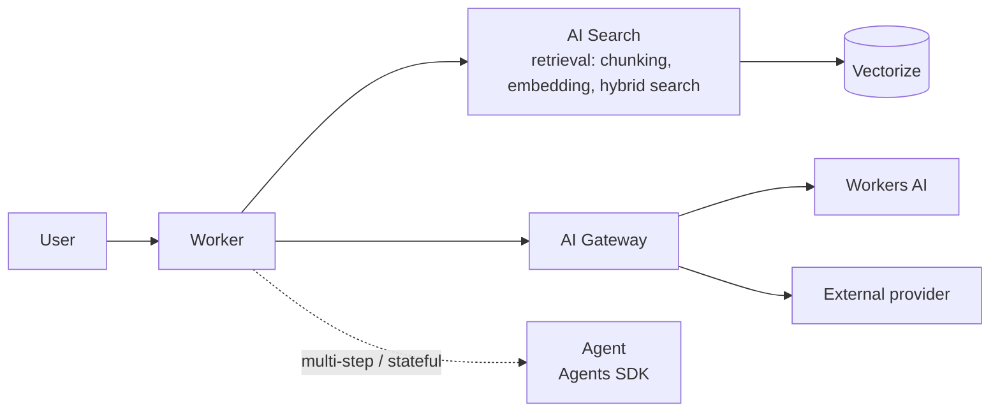

--8<-- "_snippets/disclaimer.md"

# AI & RAG Workload

An AI or retrieval-augmented generation (RAG) workload on Cloudflare composes differently from a typical API — the request path includes a model call (and often a retrieval step before it), both of which are slower, less predictable in cost, and less deterministic than a database query. All five pillars still apply; several of them just have AI-specific failure modes worth naming explicitly.

## Reference architecture

A simple RAG flow is retrieval (AI Search, backed by Vectorize) feeding context into a generation call (through AI Gateway to either Workers AI or an external model). A multi-step agent adds the Agents SDK on top, coordinating several such calls with persistent state between them.

## Applying the pillars

**Reliability — plan for model and provider failure explicitly.** A model call fails, times out, or gets rate-limited far more often than a well-behaved database query does. Configure [AI Gateway](https://developers.cloudflare.com/ai-gateway/)'s retry and fallback behavior (e.g., falling back to a secondary model or provider) rather than letting a single provider outage take down the whole feature. See [Reliability](../pillars/reliability.md) for the general principle — a Worker's global reach doesn't make an upstream model provider more available.

**Security — prompt injection is the new primary threat model for this workload shape.** Any path where user-controlled text reaches a model — directly, or indirectly through retrieved documents in a RAG pipeline — is a prompt injection surface. Put [AI Security for Apps](https://developers.cloudflare.com/reference-architecture/architectures/ai-security-for-apps/) in front of it rather than relying on prompt-engineering alone to resist manipulation; see [Security](../pillars/security.md) for the layered-defense principle this extends.

**Cost Optimization — caching matters more here than almost any other workload shape.** Model inference is usually the most expensive operation in the request path by a wide margin. [AI Gateway](https://developers.cloudflare.com/ai-gateway/)'s caching can turn a repeated or near-duplicate query into a free response instead of a billed model call — treat cache hit ratio as a primary cost lever, more directly tied to spend here than the general [Cost Optimization](../pillars/cost-optimization.md) guidance's caching point.

**Operational Excellence — observability needs to cover the model call, not just the Worker.** Standard Workers Observability tells you the Worker ran; [AI Gateway](https://developers.cloudflare.com/ai-gateway/)'s analytics tell you what the model call actually cost, how long it took, and whether it fell back to a secondary provider — both are necessary, and [Operational Excellence](../pillars/operational-excellence.md)'s "instrument before you need it" principle applies to the AI Gateway layer specifically, not just the Worker.

**Performance Efficiency — retrieval quality and model choice trade off against latency, deliberately.** A larger model or a wider retrieval window (more chunks from [AI Search](https://developers.cloudflare.com/ai-search/)) generally improves response quality and generally increases latency and cost — this is a real, workload-specific trade-off to make explicitly rather than defaulting to the largest model and widest retrieval "to be safe." See [Performance Efficiency](../pillars/performance-efficiency.md) for the general measure-before-assuming principle.

## When this isn't the right fit

- **Workloads needing a specific frontier model as a hard requirement, with no tolerance for provider fallback** — AI Gateway's fallback behavior is a reliability asset for most workloads, but if only one specific model's exact behavior is acceptable, design the fallback path (or lack of one) deliberately rather than assuming interchangeability.
- **Extremely latency-sensitive paths** (sub-100ms budgets) — a model call, even a fast one, typically dominates request latency; this workload shape is a poor fit for a hard low-latency budget.
- **High-volume, low-value-per-request use cases without caching potential** — if most queries are unique and uncacheable, the cost model here behaves very differently from a cached, repeat-query-heavy workload; re-cost before assuming the economics work at scale (see [Cost Optimization](../pillars/cost-optimization.md)).

## Further reading

- [AI Gateway](https://developers.cloudflare.com/ai-gateway/)
- [Workers AI](https://developers.cloudflare.com/workers-ai/)
- [Vectorize](https://developers.cloudflare.com/vectorize/)
- [AI Search](https://developers.cloudflare.com/ai-search/)
- [Agents SDK](https://developers.cloudflare.com/agents/)
- [AI Security for Apps reference architecture](https://developers.cloudflare.com/reference-architecture/architectures/ai-security-for-apps/)
- [Cloudflare Adoption Framework — Adopting AI on Cloudflare](https://github.com/kevinevans1/cloudflare-adoption-framework) for the org-level governance counterpart to this workload page
