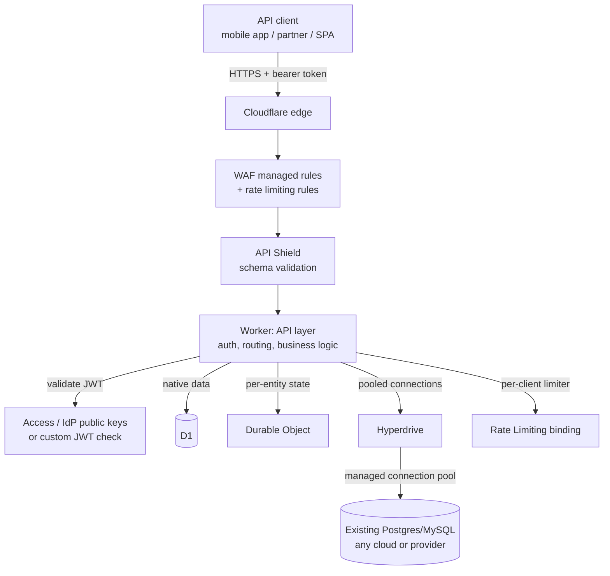

--8<-- "_snippets/disclaimer.md"

# APIs & backends

This is a Worker (or set of Workers) that answers programmatic requests — JSON in, JSON out — for a mobile app, a third-party integration, or a partner. There's no HTML rendering to speak of; the design center is request validation, auth, data access, and abuse resistance under load you don't fully control.

Cloudflare's pitch for this shape: the API layer, auth checks, schema enforcement, and rate limiting can all live at the edge, in front of wherever your data actually lives — including an existing regional database you have no intention of migrating.

- [Workers](https://developers.cloudflare.com/workers/) is the API layer.
- Data access is [D1](https://developers.cloudflare.com/d1/) or [Durable Objects](https://developers.cloudflare.com/durable-objects/) for data that's natively Cloudflare-hosted, or [Hyperdrive](https://developers.cloudflare.com/hyperdrive/) when the system of record is an existing Postgres or MySQL database (on any cloud, including AWS, Google Cloud, and Azure, or with providers like Neon and PlanetScale). Hyperdrive maintains a pool of connections close to that database and lets Workers reuse them instead of opening a new one per invocation — what makes a serverless-per-request compute model viable against a database with a hard connection-count ceiling.
- On top of the data path, [API Shield](https://developers.cloudflare.com/api-shield/) validates requests against an OpenAPI schema, and [Rate Limiting](https://developers.cloudflare.com/workers/runtime-apis/bindings/rate-limit/) — available both as a WAF rule and as a Workers binding — controls abuse per client.

## Reference architecture

Component wiring, in order:

1. **Traffic hits the edge first**, where [WAF managed rulesets](https://developers.cloudflare.com/waf/account/managed-rulesets/) and [rate limiting rules](https://developers.cloudflare.com/waf/rate-limiting-rules/) filter obviously malicious or abusive requests before they cost you a Worker invocation.
2. **API Shield validates the request shape.** With an OpenAPI schema uploaded (or a learned schema from observed traffic via [schema learning](https://developers.cloudflare.com/api-shield/management-and-monitoring/endpoint-management/schema-learning/)), API Shield's [schema validation](https://developers.cloudflare.com/api-shield/security/schema-validation/) rejects malformed bodies, wrong types, and unexpected fields before your application code has to defend against them.
3. **The Worker authenticates the caller.** For a Cloudflare Access token, the Worker validates the `Cf-Access-Jwt-Assertion` header against Access's public keys (see [Validating JSON Web Tokens](https://developers.cloudflare.com/access/setting-up-access/validate-jwt-tokens)); for a self-issued JWT or external IdP token, the Worker performs the equivalent signature/claims check itself, always fetching the current signing key from the issuer's JWKS endpoint rather than hardcoding it, since keys rotate. API Shield also offers standalone [JWT validation](https://developers.cloudflare.com/api-shield/security/jwt-validation/) as a managed check ahead of the Worker.
4. **Data access branches by system of record.** Data natively on Cloudflare goes to D1 (relational) or a Durable Object (per-entity, strongly consistent — e.g. a rate-limited resource or a session). Data in an existing regional database goes through Hyperdrive, which pools and reuses connections rather than the Worker opening a fresh one per request.
5. **A Rate Limiting binding enforces per-client limits inside application logic** — for example, a lower limit for free-tier API keys than paid ones — complementing the zone-level WAF rate limiting rule, which is coarser and applies before the Worker runs at all.

## Applying the pillars

### Security

This is the pillar this workload leans on hardest.

- Validate schema before business logic runs — a request that's the wrong shape shouldn't reach your data layer at all.
- Verify JWTs against a live JWKS endpoint, not a value copied into a secret once; Cloudflare and most identity providers rotate signing keys periodically.
- Layer WAF rules, API Shield, and application-level checks rather than relying on any single one — each catches a different failure mode.

See [Security](../pillars/security.md) for the full defense-in-depth model.

### Reliability

When Hyperdrive is in the data path, the regional database it fronts is a real dependency with its own availability characteristics — Hyperdrive accelerates and pools connections to it, it doesn't make it globally distributed or immune to an outage in its home region. Design retries and circuit-breaking in the Worker around that call the same way you would for any external dependency, and decide up front what a degraded response looks like when the database is unreachable. See [Reliability](../pillars/reliability.md).

### Performance Efficiency

Hyperdrive's value is concentrated in reducing per-request connection overhead and shortening the network path to the database from wherever the pool is placed — it does not turn a single-region Postgres instance into a globally low-latency store. For data that genuinely needs to be fast everywhere, prefer D1, KV, or Durable Objects, and reserve Hyperdrive-fronted regional databases for data that must stay in an existing system of record. Tune the [connection pool size](https://developers.cloudflare.com/hyperdrive/configuration/tune-connection-pool/) against your database's actual connection ceiling. See [Performance Efficiency](../pillars/performance-efficiency.md).

### Cost Optimization

Rate limiting isn't only a security control here — it's a cost control, since an unbounded client can otherwise generate unbounded Worker invocations and downstream database load. Prefer rejecting abusive traffic at the WAF layer (before a Worker runs) over rejecting it inside the Worker, when the traffic is clearly not legitimate. See [Cost Optimization](../pillars/cost-optimization.md).

### Operational Excellence

Treat your OpenAPI schema as a build artifact that ships with your code, not a document that drifts out of sync with what the Worker actually accepts — [schema learning](https://developers.cloudflare.com/api-shield/management-and-monitoring/endpoint-management/schema-learning/) is useful for catching drift, but the schema itself should be source-controlled. Version your API routes deliberately so schema-validation changes don't silently break existing clients. See [Operational Excellence](../pillars/operational-excellence.md).

## When this isn't the right fit

- **Your backend is a thin CRUD wrapper with no meaningful validation, auth, or abuse surface** — API Shield and dedicated rate-limiting infrastructure are overhead you may not need yet; a plain Worker with D1 is enough until the API has real external consumers.
- **Your database can't tolerate any connection pooling proxy in front of it** for compliance or driver-compatibility reasons — verify Hyperdrive's supported databases and connection modes before assuming it fits.
- **You need transactional guarantees across multiple regional databases in a single request** — Hyperdrive accelerates access to one database at a time; it isn't a distributed-transaction coordinator.

## Further reading

- [Workers overview](https://developers.cloudflare.com/workers/)
- [Hyperdrive overview](https://developers.cloudflare.com/hyperdrive/)
- [Tune Hyperdrive connection pooling](https://developers.cloudflare.com/hyperdrive/configuration/tune-connection-pool/)
- [API Shield overview](https://developers.cloudflare.com/api-shield/)
- [API Shield: Schema validation](https://developers.cloudflare.com/api-shield/security/schema-validation/)
- [API Shield: Schema learning](https://developers.cloudflare.com/api-shield/management-and-monitoring/endpoint-management/schema-learning/)
- [API Shield: JWT validation](https://developers.cloudflare.com/api-shield/security/jwt-validation/)
- [Validating JSON Web Tokens (Access)](https://developers.cloudflare.com/access/setting-up-access/validate-jwt-tokens)
- [Rate Limiting (Workers binding)](https://developers.cloudflare.com/workers/runtime-apis/bindings/rate-limit/)
- [WAF rate limiting rules](https://developers.cloudflare.com/waf/rate-limiting-rules/)
- [WAF managed rulesets](https://developers.cloudflare.com/waf/account/managed-rulesets/)
- [D1 overview](https://developers.cloudflare.com/d1/)
