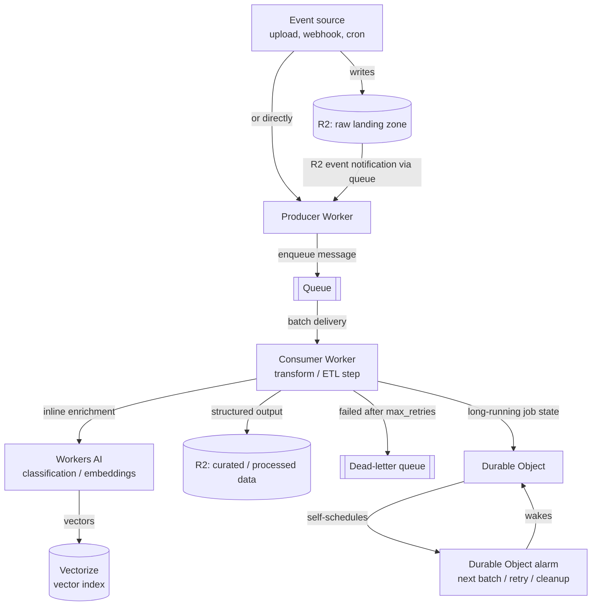

--8<-- "_snippets/disclaimer.md"

# Event-driven & data pipelines

This is asynchronous processing: work that doesn't need to complete within the lifetime of an HTTP request. Ingesting uploaded files, transforming and enriching records, fanning work out to multiple consumers, retrying failures without blocking the producer — anything shaped like "something happened, now go process it" rather than "answer this request right now."

- [Queues](https://developers.cloudflare.com/queues/) is the backbone: a [producer Worker](https://developers.cloudflare.com/queues/get-started/) writes messages to a queue, and one or more [consumer Workers](https://developers.cloudflare.com/queues/get-started/) receive batches of messages and process them, with [configurable retries](https://developers.cloudflare.com/queues/configuration/batching-retries/) and an optional [dead-letter queue](https://developers.cloudflare.com/queues/configuration/dead-letter-queues/) for messages that exhaust their retry budget.
- [R2](https://developers.cloudflare.com/r2/) is a natural landing zone for raw data — files land in a bucket, an event triggers processing, and R2's lack of egress fees matters a lot here since a data lake pattern often means the same objects get read repeatedly by different downstream jobs.
- Where a job needs to track its own progress or run on a schedule independent of any queue message, a [Durable Object with an alarm](https://developers.cloudflare.com/durable-objects/api/alarms/) gives you a durable, self-scheduling unit of work.
- [Workers AI](https://developers.cloudflare.com/workers-ai/) fits in as an inline enrichment step — classification, summarization, embedding generation — when a pipeline stage needs a model inference rather than deterministic transform logic. [Vectorize](https://developers.cloudflare.com/vectorize/) is where those embeddings land if the pipeline's purpose is building a searchable index rather than just transforming records.

## Reference architecture

Component wiring, in order:

1. **Something produces an event**: a file upload to R2 (which can emit an [event notification](https://developers.cloudflare.com/r2/buckets/event-notifications/) — R2 always writes these to a queue, which a consumer Worker then processes, rather than invoking a Worker directly), an inbound webhook hitting a Worker directly, or a scheduled trigger.
2. **A producer Worker enqueues a message.** Producers and consumers are just Workers with different bindings — a Worker can be both, but separating them keeps the ingest path (which must be fast and not blocked on processing) decoupled from the processing path (which can be slow, batched, and retried).
3. **A consumer Worker receives messages in batches** and does the transform/ETL work. [Batching, retries, and delays](https://developers.cloudflare.com/queues/configuration/batching-retries/) are configured per consumer: batch size, how long to wait for a batch to fill, retries before giving up. By default, a failure retries the whole batch unless individual messages are explicitly acknowledged — a detail that matters a lot for idempotency design.
4. **A dead-letter queue catches messages that exhaust `max_retries`.** Without one configured, messages that repeatedly fail are simply discarded — configure a DLQ for anything you need to investigate or reprocess later, rather than relying on logs alone.
5. **Workers AI enrichment happens inline in the consumer** when a step needs a model rather than a deterministic function — for example, classifying a support ticket or generating an embedding from ingested text. If the goal is a searchable/semantic index, the resulting vectors are written to Vectorize.
6. **Durable Object alarms cover the scheduling half of the pipeline** that queues aren't built for: a per-entity job that needs to check back on itself later, batch up events over a time window before acting, or run recurring cleanup. An alarm fires the `alarm()` handler at a scheduled time with [at-least-once execution and automatic retry with exponential backoff](https://developers.cloudflare.com/durable-objects/api/alarms/) if the handler throws.

## Applying the pillars

### Reliability

Queues give you at-least-once delivery, not exactly-once — design consumers to be idempotent (safe to process the same message twice) rather than assuming a message arrives exactly once. Configure a dead-letter queue for anything where silently dropping a failed message after retries is unacceptable, and monitor it — a DLQ that nobody looks at is just a slower way to lose data. See [Reliability](../pillars/reliability.md).

### Cost Optimization

Batch size and retry configuration directly affect cost: small batches invoke the consumer more often for the same volume of work, and aggressive retries on a message that will never succeed (a permanently malformed record, say) burn invocations for no benefit — validate and fail fast rather than retrying blindly. R2's lack of egress fees is a genuine advantage for a pipeline that reads the same landing-zone data from multiple downstream jobs, compared to a storage tier that charges per read/egress across services. See [Cost Optimization](../pillars/cost-optimization.md).

### Operational Excellence

Treat the dead-letter queue as a monitored operational surface, not a bit bucket — alert on it filling up. Version your message schema deliberately, since a producer and consumer can be deployed independently and a schema change that isn't backward-compatible will silently corrupt in-flight processing. See [Operational Excellence](../pillars/operational-excellence.md).

### Performance Efficiency

Tune batch size and max wait time to match the actual latency sensitivity of the pipeline stage — a stage feeding a user-facing "processing complete" notification wants small batches and short waits; a nightly aggregation job wants the opposite, since larger batches amortize invocation overhead. See [Performance Efficiency](../pillars/performance-efficiency.md).

### Security

Data landing in R2 as a raw ingest zone is still data at rest that needs the same access-control discipline as any other bucket — don't treat a "landing zone" as inherently lower-sensitivity than the curated output. If the pipeline processes data on behalf of multiple tenants, isolate it at the queue and storage level (separate queues or key prefixes) rather than relying on application logic alone to keep tenants apart. See [Security](../pillars/security.md).

## When this isn't the right fit

- **The work genuinely needs to complete before you can respond to the caller** — that's a synchronous request/response problem; forcing it through a queue just adds latency and complexity. See [APIs & backends](apis-and-backends.md) instead.
- **You need strict message ordering guarantees across an entire pipeline** — Cloudflare Queues explicitly does not guarantee messages are delivered to a consumer in the same order they were published, regardless of consumer concurrency settings. If a specific piece of work needs strict ordering, route those messages to a single Durable Object (or use Workflows) to serialize processing rather than relying on the queue itself.
- **Your "pipeline" is actually one Worker doing one synchronous transform on each request** — that doesn't need Queues at all; introducing a queue only pays off once you need decoupling, retries, or fan-out that a direct call can't give you.

## Further reading

- [Cloudflare Queues overview](https://developers.cloudflare.com/queues/)
- [Queues: Get started](https://developers.cloudflare.com/queues/get-started/)
- [Batching, Retries and Delays](https://developers.cloudflare.com/queues/configuration/batching-retries/)
- [Dead Letter Queues](https://developers.cloudflare.com/queues/configuration/dead-letter-queues/)
- [R2 overview](https://developers.cloudflare.com/r2/)
- [Durable Objects Alarms API](https://developers.cloudflare.com/durable-objects/api/alarms/)
- [Workers AI overview](https://developers.cloudflare.com/workers-ai/)
- [Vectorize overview](https://developers.cloudflare.com/vectorize/)
- [Cloudflare Reference Architecture: Serverless ETL pipelines](https://developers.cloudflare.com/reference-architecture/diagrams/serverless/serverless-etl/)
