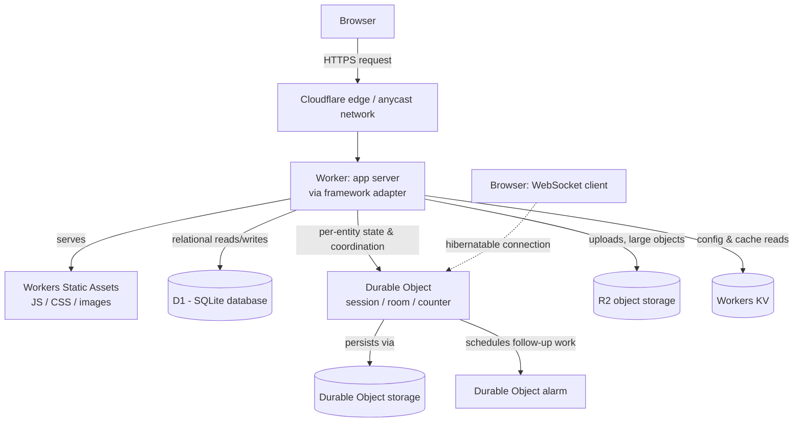

--8<-- "_snippets/disclaimer.md"

# Full-stack apps on Workers

This is the shape for an application with real server-side logic and state: a SaaS product, an internal tool, a dashboard — anything where the server renders pages, runs business logic per request, and reads/writes durable data, not just serving files or proxying an external API.

[Workers](https://developers.cloudflare.com/workers/) is the application server here, and increasingly you don't hand-wire it: framework adapters let popular full-stack frameworks run natively on the Workers runtime rather than behind a translation layer.

- **Next.js** — Cloudflare's documented default is [vinext](https://developers.cloudflare.com/workers/framework-guides/web-apps/nextjs/), a Vite plugin that reimplements the Next.js API surface so a Next.js app runs directly against Workers. Apps built on the older OpenNext adapter remain supported where migrating isn't yet practical.
- **React Router** (formerly shipped as Remix) and **Astro** have production-ready adapters too, both built on the Cloudflare Vite plugin, which runs your dev server against the real Workers runtime rather than a simulation.
- Check the [framework guides index](https://developers.cloudflare.com/workers/framework-guides/) for current status before committing — this is one of the fastest-moving parts of the platform.

State and storage attach as bindings rather than network calls: [D1](https://developers.cloudflare.com/d1/) for relational data, [Durable Objects](https://developers.cloudflare.com/durable-objects/) for per-entity strongly consistent state (a document, a session, a collaborative room), [R2](https://developers.cloudflare.com/r2/) for uploads and large assets, and [Workers KV](https://developers.cloudflare.com/kv/) for config and cache data that tolerates [eventual consistency](https://developers.cloudflare.com/kv/concepts/how-kv-works/). Why Workers over a traditional app-server-plus-managed-database stack: the app server has no cold-start penalty worth designing around (Workers run on V8 isolates, not containers — see [how Workers works](https://developers.cloudflare.com/workers/reference/how-workers-works/)), it scales per-request with no capacity to provision in advance, and storage primitives are bindings configured in code rather than separate infrastructure to network into.

## Reference architecture

Component wiring, in order:

1. **The edge terminates the request and invokes the Worker.** With a framework adapter (vinext, React Router, or Astro's Cloudflare adapter), the Worker's `fetch` handler is generated by the framework's build step — you write route handlers/loaders in the framework's idioms, and the adapter compiles them into a single Worker.
2. **Static build output** (JS bundles, CSS, images) is served as Workers Static Assets alongside the Worker, so a request for a static file never touches your application code.
3. **D1 handles relational data** the app needs across requests: users, orders, anything you'd model as rows and query with SQL. D1 is Cloudflare's managed database built on SQLite's query engine, accessed from the Worker via a binding.
4. **Durable Objects hold per-entity state that needs strong consistency or coordination.** A single Durable Object instance is the sole owner of its state and processes requests to it serially — the right tool for a WebSocket-backed collaborative session, a rate limiter, or a per-user session object, where D1's request-scoped model or KV's eventual consistency wouldn't be safe. A Durable Object can schedule itself to wake up later via the [Alarms API](https://developers.cloudflare.com/durable-objects/api/alarms/), useful for session expiry, deferred cleanup, or batching. For chat/presence/game-state objects, the [WebSocket Hibernation API](https://developers.cloudflare.com/durable-objects/) lets a Durable Object hold many open WebSocket connections while billed only for active compute, not idle connection time.
5. **R2 stores uploads and large binary objects** — user-uploaded files, generated PDFs, media — accessed from the Worker via a binding or, for direct client uploads, presigned URLs.
6. **KV holds config and cacheable, read-heavy data** — feature flags, cached rendered fragments — where a write becoming visible globally within roughly a minute (rather than instantly) is an acceptable tradeoff for very fast, very cheap global reads.

## Applying the pillars

### Reliability

The main design decision is matching each piece of state to the consistency model it actually needs: D1 for transactional relational data, Durable Objects where a single owner must serialize access to avoid races (never split that state across KV and hope), and KV only for data that's fine being briefly stale. Getting this wrong tends to produce subtle race conditions under load, not clean failures. See [Reliability](../pillars/reliability.md).

### Security

Framework adapters generate a real Worker, so ordinary Workers security practices apply in full: validate all inputs at the handler, don't trust client-set headers for auth decisions, and keep secrets in [Wrangler secrets](https://developers.cloudflare.com/workers/) rather than environment variables checked into the repo. If the app exposes JSON endpoints alongside its rendered pages, treat those as you would in [APIs & backends](apis-and-backends.md) — schema validation and rate limiting still apply even when most of the app is server-rendered HTML. See [Security](../pillars/security.md).

### Cost Optimization

Durable Objects billing is duration-based, which makes the WebSocket Hibernation API a real cost lever, not just a nice-to-have — an object holding hundreds of idle WebSocket connections without hibernation can accumulate meaningful active-duration charges for doing nothing. Choose KV over Durable Objects for anything that doesn't need strong consistency; KV reads are cheap and cacheable, Durable Object invocations are not. See [Cost Optimization](../pillars/cost-optimization.md).

### Operational Excellence

Because state lives in several different primitives, your migration and rollback story needs to cover all of them, not just D1 schema migrations — a Durable Object class rename or storage-key format change is a compatibility hazard the same way a database migration is. Test framework-adapter upgrades against a preview deployment before rolling to production; adapter behavior around routing and asset handling has changed with framework versions. See [Operational Excellence](../pillars/operational-excellence.md).

### Performance Efficiency

A Durable Object instance runs in one location, and every request to it is routed there — for a global user base, requests from far-away regions incur real latency to reach it. If low-latency access from multiple regions is a hard requirement for a specific object type, design around it directly (e.g. partitioning by region); don't expect Smart Placement to fix it. [Smart Placement](https://developers.cloudflare.com/workers/configuration/placement/) helps a Worker sit closer to a single backend dependency — it doesn't move a Durable Object. See [Performance Efficiency](../pillars/performance-efficiency.md).

## When this isn't the right fit

- **You have an existing framework app with heavy dependence on Node.js-specific infrastructure** (native modules, long-lived background threads) that the current Workers Node.js compatibility surface doesn't cover — check the framework guide and Workers Node.js compatibility docs for gaps before committing.
- **Your state is genuinely a large, ad hoc relational schema with complex joins at scale** — D1 is a real SQL database but designed around Workers' per-request model and per-database limits; a very large, highly relational OLTP workload may be better served by a regional database reached through [Hyperdrive](https://developers.cloudflare.com/hyperdrive/) (see [APIs & backends](apis-and-backends.md)).
- **You need a single strongly consistent object serving very high global read volume with low latency everywhere** — a single Durable Object is one instance in one location; that's a feature for correctness, but a constraint for global low-latency fan-out.

## Further reading

- [Workers overview](https://developers.cloudflare.com/workers/)
- [How Workers works](https://developers.cloudflare.com/workers/reference/how-workers-works/)
- [Framework guides](https://developers.cloudflare.com/workers/framework-guides/)
- [Next.js on Workers (vinext)](https://developers.cloudflare.com/workers/framework-guides/web-apps/nextjs/)
- [React Router on Workers](https://developers.cloudflare.com/workers/framework-guides/web-apps/react-router/)
- [D1 overview](https://developers.cloudflare.com/d1/)
- [Durable Objects overview](https://developers.cloudflare.com/durable-objects/)
- [Durable Objects Alarms API](https://developers.cloudflare.com/durable-objects/api/alarms/)
- [Rules of Durable Objects](https://developers.cloudflare.com/durable-objects/best-practices/rules-of-durable-objects/)
- [R2 overview](https://developers.cloudflare.com/r2/)
- [Workers KV: how KV works](https://developers.cloudflare.com/kv/concepts/how-kv-works/)
- [Choosing a data or storage product](https://developers.cloudflare.com/workers/platform/storage-options/)
- [Smart Placement](https://developers.cloudflare.com/workers/configuration/placement/)
