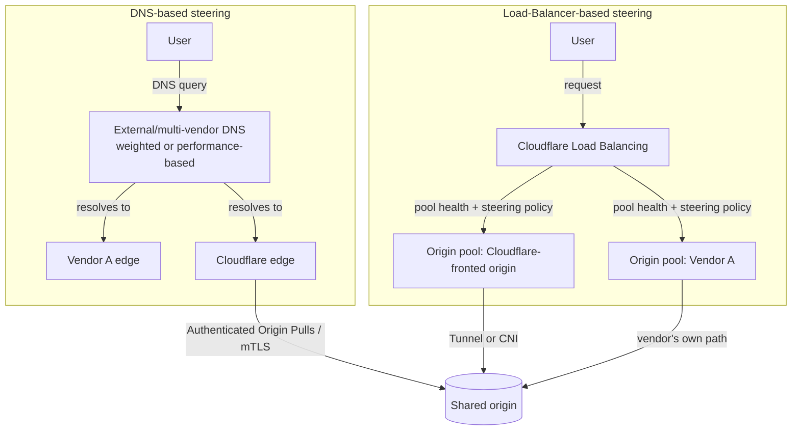

--8<-- "_snippets/disclaimer.md"

# Multi-CDN & hybrid front door

Large enterprises frequently run Cloudflare alongside another CDN, security vendor, or cloud provider's edge — sometimes by choice (vendor diversification, contractual commitments, gradual migration), sometimes because different business units adopted different vendors before anyone tried to unify them. This page covers what that architecture actually looks like, and what's genuinely hard about it. Cloudflare publishes its own guidance on this exact pattern in the [Reference Architecture library's multi-vendor architecture](https://developers.cloudflare.com/reference-architecture/architectures/multi-vendor/), and this page follows that guidance rather than inventing a different approach.

## Reference architecture

The two steering models that actually get used are DNS-based steering and load-balancer-based steering. They differ in where the traffic-split decision is made and how quickly it can react to a vendor outage.

Component wiring and the two patterns, in order:

1. **DNS-based steering** splits traffic before any single vendor sees it, using either an external DNS provider doing weighted or performance-based responses across vendors, or a "multi-vendor DNS" setup where more than one vendor acts as authoritative nameserver for the zone, kept in sync via zone transfers or a dual-primary configuration. This gives each vendor equal, independent visibility into the traffic it receives, but reacting to an outage means changing DNS answers — bounded by TTL and resolver caching behavior, not instant.
2. **Load-Balancer-based steering** puts [Cloudflare Load Balancing](https://developers.cloudflare.com/load-balancing/) (or the equivalent on another vendor) in front, with [origin pools](https://developers.cloudflare.com/load-balancing/pools/create-pool/) representing each vendor or path, active health checks determining which pools are eligible, and a steering policy (geographic, latency-based, or weighted) deciding where traffic goes. This reacts faster to a failure because health checks can pull an unhealthy pool out of rotation without waiting on DNS TTLs.
3. **"Stacked" configurations** — one vendor sitting behind another in the request path — carry a real disadvantage Cloudflare's own guidance calls out: whichever vendor is behind the other loses full traffic visibility, since it only sees what the front vendor forwards. Prefer side-by-side steering (either pattern above) over stacking where full traffic visibility matters for either vendor's security or performance tooling.
4. **Origin connectivity depends on the pattern.** A Cloudflare-fronted path to a shared origin can use [Cloudflare Tunnel](https://developers.cloudflare.com/cloudflare-one/networks/connectors/cloudflare-tunnel/configure-tunnels/tunnel-availability/) or Cloudflare Network Interconnect for private connectivity, plus [Authenticated Origin Pulls](https://developers.cloudflare.com/reference-architecture/architectures/multi-vendor/) (mTLS) so the origin can verify a request genuinely came through Cloudflare rather than being spoofed. Enforce this specifically because a shared origin behind multiple vendors is reachable by more paths than a single-vendor setup, widening the surface an attacker could try to bypass.

## Applying the pillars

### Operational Excellence

This is where multi-vendor architectures actually get hard, and Cloudflare's own reference architecture is candid about it: the difficulty isn't the request-routing technology, it's that **configuration and management differ meaningfully between providers, which drives up the cost of a working implementation.** Keeping WAF rules, caching behavior, and TLS settings equivalent across two vendors' very different configuration models and APIs requires real automation investment — Terraform, OctoDNS, or an equivalent — plus genuine fluency in both vendors' semantics, not just one. Budget for this as an ongoing operational cost, not a one-time setup task; vendor configuration surfaces change over time, and drift is the default outcome without continuous reconciliation. See [Operational Excellence](../pillars/operational-excellence.md).

### Reliability

The point of running two vendors is usually redundancy — but that only works if failover is tested, not assumed. Load-balancer-based steering with active health checks fails over faster than DNS-based steering; know which one you're running and its actual failover latency under a real outage, not a planned drill. If you're using a stacked topology despite its visibility tradeoff, be explicit about which vendor is the reliability backstop for the other. See [Reliability](../pillars/reliability.md).

### Security

A shared origin reachable through multiple vendor paths needs origin verification that works regardless of which path a request came through — Authenticated Origin Pulls (mTLS) is the mechanism Cloudflare's guidance points to for this. Security tooling (WAF, bot management) configured on only one vendor leaves the other vendor's path as a softer target; either replicate protections on both paths or make sure the less-protected path can't reach anything sensitive. See [Security](../pillars/security.md).

### Cost Optimization

Running two vendors means paying for overlapping capability on both, plus the automation tooling to keep them in sync — rarely the cheapest way to serve traffic. Justify its cost with a specific reason (contractual, regulatory, risk-diversification) rather than defaulting into it. See [Cost Optimization](../pillars/cost-optimization.md).

### Performance Efficiency

The two steering models trade off differently on performance, not just failover speed: a latency-based (Dynamic) Load Balancing steering policy actively routes each request to whichever pool is currently fastest, where DNS-based steering only reacts as fast as resolver caching and TTLs allow. Cloudflare-specific performance features don't extend across the boundary — [Tiered Cache](https://developers.cloudflare.com/cache/how-to/tiered-cache/) and [Argo Smart Routing](https://developers.cloudflare.com/argo-smart-routing/) only accelerate the Cloudflare-fronted path, so a shared origin can end up with a meaningfully different cache hit ratio and origin round-trip time depending on which vendor a given request lands on. Measure real user latency per path rather than assuming both vendors perform equivalently just because they front the same origin. See [Performance Efficiency](../pillars/performance-efficiency.md).

## When this isn't the right fit

- **You're evaluating multi-vendor purely for redundancy and have no existing contractual or organizational reason to keep the second vendor** — a single well-configured vendor with strong internal redundancy (multiple pools, health checks, tested failover) is usually simpler to operate correctly than two vendors kept loosely in sync, and Cloudflare's own guidance is upfront that the multi-vendor cost is real, not hypothetical.
- **You don't have (or can't get) the automation investment this pattern requires** — a multi-vendor setup maintained by hand through two different dashboards will drift, and the drift itself becomes a reliability and security risk.
- **Your two vendors are stacked with one hidden behind the other** and you need full traffic visibility for security or performance decisions on the hidden one — reconsider the topology before building tooling around data you don't actually have.

## Further reading

- [Cloudflare Reference Architecture: Multi-vendor architecture](https://developers.cloudflare.com/reference-architecture/architectures/multi-vendor/)
- [Cloudflare Load Balancing overview](https://developers.cloudflare.com/load-balancing/)
- [Load Balancing: manage pools](https://developers.cloudflare.com/load-balancing/pools/create-pool/)
- [Cloudflare Tunnel: availability and replicas](https://developers.cloudflare.com/cloudflare-one/networks/connectors/cloudflare-tunnel/configure-tunnels/tunnel-availability/)
- [Cloudflare Reference Architecture library](https://developers.cloudflare.com/reference-architecture/)
