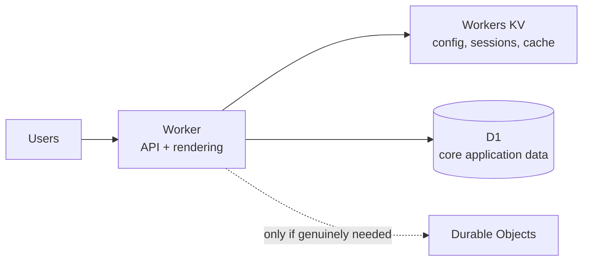

# Startup Workload

A startup's early workload has a different optimization target than an established one: speed of iteration and low fixed cost matter more than the redundancy and operational maturity a later-stage workload needs. Applying all five pillars at full strength before there's real traffic or revenue is over-engineering — but "ignore the pillars entirely" produces the rebuild-everything-under-pressure outcome this page exists to avoid.

## Reference architecture

A single Worker in front of D1 (for real relational data) and KV (for anything read-heavy and tolerant of eventual consistency) covers most early-stage products. Durable Objects are dotted because they solve a specific coordination problem — most startups don't need them on day one, and reaching for them by default adds cost and complexity for state a simpler primitive would handle.

## Applying the pillars

**Reliability — accept some risk deliberately, but don't accept it silently.** A single-region external database or no Load Balancing failover is a reasonable trade-off pre-launch — see [Reliability](../pillars/reliability.md) — as long as it's a decision, not an oversight. Write down what happens if the origin or database goes down, even if the answer today is "we get paged and fix it manually."

**Security — take the free/low-cost baseline, skip the Enterprise-tier program.** [Bot Fight Mode](https://developers.cloudflare.com/bots/get-started/bot-fight-mode/), the Cloudflare Managed Ruleset, and basic rate limiting cover most early risk. Full [Security](../pillars/security.md) pillar guidance — API Shield schema validation, per-request bot scoring, formal Zero Trust rollout for internal tools — becomes worth the cost once there's an API surface or internal admin tooling worth specifically protecting, not before.

**Cost Optimization — this pillar matters more early than late, not less.** [Cost Optimization](../pillars/cost-optimization.md)'s core advice (don't reach for Durable Objects for high-frequency low-value state, don't provision Enterprise capability you don't need) protects runway directly. Usage-based pricing on Workers/KV/D1/R2 is a genuine advantage at this stage — no idle-VM cost while traffic is near zero.

**Operational Excellence — automate deployment before it hurts, skip the rest.** [Workers Builds](https://developers.cloudflare.com/workers/ci-cd/builds/) or a simple Wrangler-in-CI pipeline is cheap to set up and prevents the earliest, most avoidable outages (a bad deploy straight from a laptop). Full [Operational Excellence](../pillars/operational-excellence.md) maturity — Terraform-managed account config, formal staged rollout for every change — can wait until there's more than one person making changes.

**Performance Efficiency — you get most of this for free; don't undo it.** Cloudflare's anycast network already puts your Worker close to users by default. The main way a startup erodes this is calling a single-region database or third-party API on every request without caching — see [Performance Efficiency](../pillars/performance-efficiency.md). Basic [Cache Rules](https://developers.cloudflare.com/cache/how-to/cache-rules/) on genuinely static or slow-changing responses is worth the low setup cost; Smart Placement and Tiered Cache tuning can wait until there's traffic worth tuning against.

## When this isn't the right fit

- **A regulated product from day one** (handling payment or health data at launch) — see the [Cloudflare Adoption Framework's Regulated & Compliance-Heavy Orgs scenario](https://github.com/kevinevans1/cloudflare-adoption-framework) for how compliance requirements change this sequencing.
- **A workload with unusually high write-consistency needs from the start** (financial transactions, inventory with strict correctness requirements) — don't defer the Reliability pillar's consistency-model decisions just because the company is early-stage; get the data model right the first time here specifically.
- **A team large enough to already need account-level governance** — if you're past a handful of engineers with dashboard access, see the [Cloudflare Adoption Framework's Foundation phase](https://github.com/kevinevans1/cloudflare-adoption-framework) rather than treating this as a small-team exception indefinitely.

## Further reading

- [Reliability pillar](../pillars/reliability.md)
- [Security pillar](../pillars/security.md)
- [Cost Optimization pillar](../pillars/cost-optimization.md)
- [Operational Excellence pillar](../pillars/operational-excellence.md)
- [Performance Efficiency pillar](../pillars/performance-efficiency.md)
- [Cloudflare Adoption Framework — Startup scenario](https://github.com/kevinevans1/cloudflare-adoption-framework) for the organizational/account-level counterpart to this workload-level page
