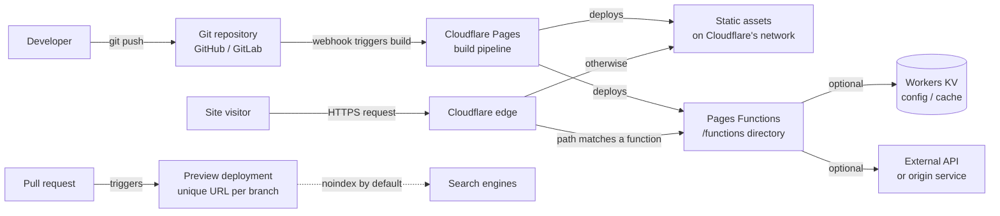

--8<-- "_snippets/disclaimer.md"

# Static sites & SPAs

This is the simplest workload shape on the platform — and for marketing pages, docs sites, blogs, and SPAs that call an external API, it's also the right one. Content is pre-built into static files (HTML, CSS, JS, images) at deploy time. Any server-side logic needed is light: redirects, headers, form handling, A/B tests, or a thin API proxy.

[Cloudflare Pages](https://developers.cloudflare.com/pages/) is purpose-built for this: connect a Git repository, Cloudflare runs your build, and the output deploys with a production URL, automatic HTTPS, and a preview URL for every branch and pull request. For dynamic behavior, [Pages Functions](https://developers.cloudflare.com/pages/functions/) add a `/functions` directory to the same project — Workers-runtime code, routed by file-based conventions, with no separate service to stand up.

Why Cloudflare over a generic static host: the build output, CDN, edge compute, and DNS/TLS all live in one control plane. Pages Functions run on the same Workers runtime as a full backend, so a site that starts static and grows a real API later needs an architectural change, not a platform migration (see [Full-stack apps on Workers](fullstack-workers.md)).

## Reference architecture

A typical setup: a push triggers a build, Cloudflare deploys the static output, and requests are served directly from the edge unless they match a Functions route — in which case a Worker executes before falling through to static assets.

Component wiring, in order:

1. **Source control drives deployment.** Pages' [Git integration](https://developers.cloudflare.com/pages/configuration/git-integration/) watches a repository: a push to the production branch triggers a production build, and any other branch gets a [preview deployment](https://developers.cloudflare.com/pages/configuration/preview-deployments/) with its own URL that updates on every commit. [Branch build controls](https://developers.cloudflare.com/pages/configuration/branch-build-controls/) limit which branches trigger a build — useful once a repo has many short-lived branches.
2. **Static assets are served directly from the edge** — no origin server, no Worker invocation, for any request that isn't routed to a Function.
3. **Pages Functions handle the dynamic slice.** A file under `/functions` (e.g. `functions/api/subscribe.js`) becomes a route matched against the incoming path, executing as a Worker before falling through to static content. Use it for form handlers, logic-driven redirects, lightweight API proxies, or A/B tests.
4. **Custom domains** attach to the Pages project the same way they attach to a Worker — Cloudflare manages the DNS record and certificate for you.
5. **Optional bindings.** A Function can bind to [Workers KV](https://developers.cloudflare.com/kv/) for config or cached data, call an external API, or use [Smart Placement](https://developers.cloudflare.com/pages/functions/smart-placement/) when its real bottleneck is round-trips to a single backend region.

## Applying the pillars

### Reliability

Static assets carry the platform's baseline availability with no origin to fail — nothing to overload during a traffic spike. The reliability surface narrows to whatever your Pages Functions touch: a Function that calls an external API synchronously makes that call a new single point of failure. Treat it like any dependency — timeouts, fallbacks, cached last-known-good responses. See [Reliability](../pillars/reliability.md).

### Performance Efficiency

This workload gets the platform's performance story almost for free: static content is cacheable at every edge location, with no origin round-trip on the hot path. Performance is really decided at build time — bundle size, image optimization, cache aggressiveness. Keep Functions on the critical path only when necessary (auth checks, personalization); everything else should be static or client-side. See [Performance Efficiency](../pillars/performance-efficiency.md).

### Cost Optimization

Static hosting is the cheapest workload shape on the platform because most requests never invoke compute at all. Watch Pages Functions invocations if you push more logic into them than needed — a redirect that could be a static `_redirects` rule doesn't need to be a Function. See [Cost Optimization](../pillars/cost-optimization.md) for how usage-based pricing changes the calculus versus a VM you'd otherwise keep idle.

### Operational Excellence

Preview deployments are the operational superpower here: every pull request gets a real, shareable URL running the actual build output, turning "does this look right" into something reviewers can click instead of imagine. By default, previews are excluded from indexing via an `X-Robots-Tag: noindex` response header — leave that alone. It's correct behavior: the header lets the URL be crawled and then excluded, rather than blindly blocking it. See [Operational Excellence](../pillars/operational-excellence.md).

### Security

Keep Functions narrowly scoped — a form-handler Function shouldn't also have a binding to your production database. If a Function accepts user input (form submissions, comments), validate and rate-limit it the same way you would a full API endpoint. See [Security](../pillars/security.md), and [APIs & backends](apis-and-backends.md) if the surface grows.

## When this isn't the right fit

- **You need server-side rendering per request with real application state** (sessions, user-specific data fetched server-side on every load) — that's [Full-stack apps on Workers](fullstack-workers.md), not this.
- **Your "light dynamic logic" has grown into a real API** with multiple endpoints, a database, and auth — treat it as [APIs & backends](apis-and-backends.md) and give it its own architecture rather than accumulating Functions ad hoc.
- **You need long-running or stateful server-side processes** — Pages Functions are Workers under the hood, so they inherit Workers' request-scoped execution model, not a persistent server process.

## Further reading

- [Cloudflare Pages overview](https://developers.cloudflare.com/pages/)
- [Pages Functions overview](https://developers.cloudflare.com/pages/functions/)
- [Pages Functions: Get started](https://developers.cloudflare.com/pages/functions/get-started/)
- [Preview deployments](https://developers.cloudflare.com/pages/configuration/preview-deployments/)
- [Git integration](https://developers.cloudflare.com/pages/configuration/git-integration/)
- [Branch build controls](https://developers.cloudflare.com/pages/configuration/branch-build-controls/)
- [Smart Placement for Pages Functions](https://developers.cloudflare.com/pages/functions/smart-placement/)
