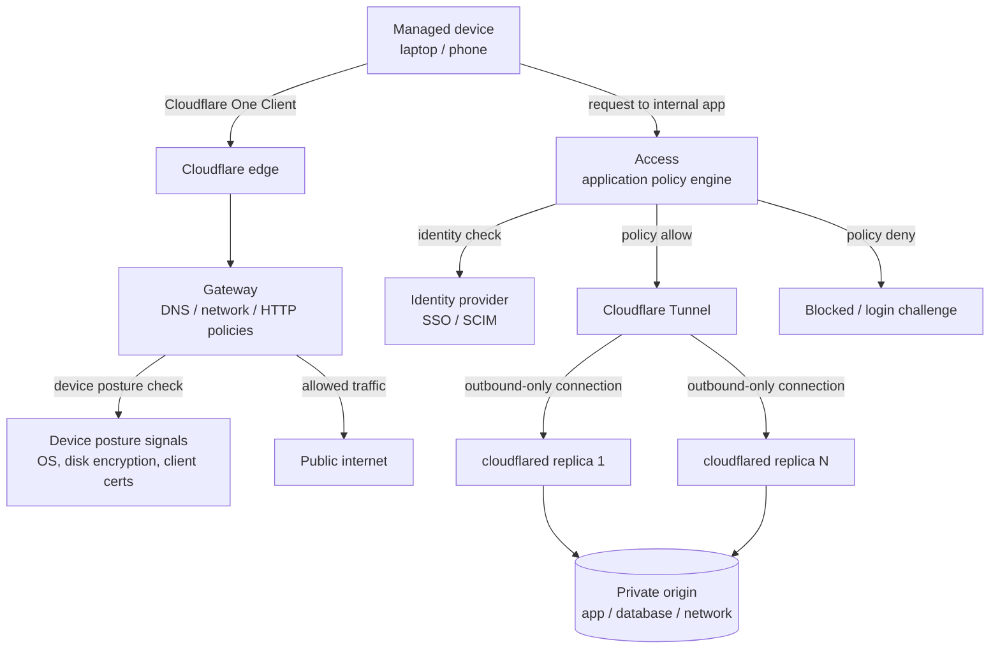

--8<-- "_snippets/disclaimer.md"

# Zero Trust / SASE

Most workloads in this section are applications you build. This one is different: the "workload" is the Zero Trust deployment itself — the always-on control plane that authenticates every request to internal apps, filters and inspects outbound traffic from every managed device, and replaces a traditional VPN/perimeter model with per-request, identity-aware access decisions. Once it's live, it behaves like any other production system: it has an availability target, an attack surface, an operating cost, an operational burden, and a performance profile users will notice if it's wrong.

This page is scoped to **steady-state architecture** — how the pieces fit together once deployed. It does not cover rollout sequencing, change management, or org-wide adoption (which app to migrate first, how to phase WARP, how to communicate device enrollment) — that's the companion [Cloudflare Adoption Framework](https://github.com/kevinevans1/cloudflare-adoption-framework) repository's Zero Trust adoption path. If you're planning a rollout rather than reviewing a running deployment, start there and come back here for the architecture you're rolling out.

The components:

- [Access](https://developers.cloudflare.com/cloudflare-one/) enforces identity-and-context-aware authorization in front of applications.
- [Gateway](https://developers.cloudflare.com/cloudflare-one/traffic-policies/) is the secure web gateway inspecting and filtering DNS, network, and HTTP traffic from managed devices.
- [Tunnel](https://developers.cloudflare.com/cloudflare-one/networks/connectors/cloudflare-tunnel/configure-tunnels/tunnel-availability/) connects private origins to Cloudflare's network without exposing them to the public internet.
- The [Cloudflare One Client](https://developers.cloudflare.com/cloudflare-one/team-and-resources/devices/cloudflare-one-client/) (formerly branded WARP) is the device agent that forwards traffic and reports device posture.

All of it sits under the [Cloudflare One](https://developers.cloudflare.com/cloudflare-one/) umbrella and a single policy control plane.

## Reference architecture

Component wiring, in order:

1. **Every managed device runs the Cloudflare One Client**, which forwards DNS, network, and/or HTTP traffic to Cloudflare's edge depending on the configured [client mode](https://developers.cloudflare.com/cloudflare-one/team-and-resources/devices/cloudflare-one-client/) and reports device state (OS version, disk encryption, required software, third-party posture signals from providers like CrowdStrike) for use in policy decisions.
2. **Gateway evaluates outbound traffic** against DNS, network (Layer 4), and HTTP (Layer 7) policies before allowing it to reach the public internet — this is the "secure web gateway" half of the deployment, unrelated to access into your own applications.
3. **Access evaluates inbound requests to internal applications**, checking identity (via your SSO/IdP), device posture, and other configured signals against an application's policy before allowing the request through. Access applications are deny-by-default: a request that doesn't match an explicit allow policy is rejected.
4. **Tunnel connects the application's actual origin to Cloudflare** without any inbound port exposed on the origin's network — `cloudflared` running next to the origin establishes outbound-only connections to Cloudflare. Each tunnel maintains multiple long-lived connections to Cloudflare data centers by default, and additional [replicas](https://developers.cloudflare.com/cloudflare-one/networks/connectors/cloudflare-tunnel/configure-tunnels/tunnel-availability/) — additional `cloudflared` instances pointed at the same tunnel — provide redundancy if a connector host or its network path fails. Replicas exist for high availability, not load balancing; Cloudflare doesn't spread load evenly across them by design.
5. **The identity provider is the source of truth Access checks against** — group membership, MFA status, and session validity all flow from here into every Access policy decision.

## Applying the pillars

### Reliability

Tunnel redundancy is the load-bearing reliability decision: a single `cloudflared` instance is a single point of failure for everything behind that tunnel, regardless of how resilient the origin itself is. Run multiple replicas across separate hosts (and ideally separate network paths) for any tunnel fronting a production dependency. On the Access side, an IdP outage is a real dependency failure — know what "identity provider is down" does to your Access policies (whether cached sessions continue to work, and for how long) before it happens in production. See [Reliability](../pillars/reliability.md).

### Security

This deployment *is* your perimeter now, which makes its own configuration the highest-leverage security surface in the org: an overly broad Access policy or a Gateway rule that's more permissive than intended has blast radius across every application and every device behind it. Use [device posture checks](https://developers.cloudflare.com/cloudflare-one/reusable-components/posture-checks/access-integrations/) as a real second signal alongside identity, not a checkbox — see the [reference architecture guide on designing ZTNA access policies](https://developers.cloudflare.com/reference-architecture/design-guides/designing-ztna-access-policies/) for policy-design patterns. Audit Access policies periodically; policies drift toward permissiveness as exceptions accumulate. See [Security](../pillars/security.md).

### Cost Optimization

Zero Trust products are typically licensed per user/seat rather than per request, which flips the usual serverless cost model — the design lever is entitlement hygiene (deprovisioning departed users and stale service tokens promptly) more than traffic shaping. See [Cost Optimization](../pillars/cost-optimization.md).

### Operational Excellence

Configuration-as-code matters enormously here because Access and Gateway policies are security controls, not just settings — manage them through Terraform or the API rather than clicking through the dashboard, so changes are reviewed and reversible. Monitor Tunnel connector health and Gateway/Access logs continuously; a quietly disconnected tunnel replica or a misfiring policy can go unnoticed until someone can't get to a resource they need. See [Operational Excellence](../pillars/operational-excellence.md) and the companion [Adoption Framework](https://github.com/kevinevans1/cloudflare-adoption-framework)'s guidance on operating the platform post-rollout.

### Performance Efficiency

Routing all traffic through Gateway adds a hop that's usually negligible on Cloudflare's network but is worth validating for latency-sensitive internal applications — test real user experience for the specific client modes you deploy (DNS-only vs. full traffic forwarding) rather than assuming it's a non-issue. See [Performance Efficiency](../pillars/performance-efficiency.md).

## When this isn't the right fit

- **You need this deployed and operating well next quarter and have no existing Zero Trust footprint** — that's a phased rollout problem before it's an architecture problem; see the [Cloudflare Adoption Framework](https://github.com/kevinevans1/cloudflare-adoption-framework)'s Zero Trust adoption path for sequencing, not this page.
- **Your workforce and applications are small enough that a simpler access model meets your actual risk profile** — a full SASE deployment has real ongoing operational overhead (policy maintenance, device enrollment, posture-check tuning) that isn't free even when the product cost is manageable.
- **You need to support unmanaged, unenrolled devices as a first-class case** — device posture checks assume a device running the Cloudflare One Client; access from arbitrary unmanaged devices needs a different policy design (browser-based Access with weaker posture signals, or isolation-only patterns).

## Further reading

- [Cloudflare Adoption Framework: Zero Trust adoption path](https://github.com/kevinevans1/cloudflare-adoption-framework)
- [Cloudflare One overview](https://developers.cloudflare.com/cloudflare-one/)
- [About the Cloudflare One Client](https://developers.cloudflare.com/cloudflare-one/team-and-resources/devices/cloudflare-one-client/)
- [Cloudflare One traffic policies (Gateway)](https://developers.cloudflare.com/cloudflare-one/traffic-policies/)
- [Access policies](https://developers.cloudflare.com/cloudflare-one/access-controls/policies/common-policies/)
- [Cloudflare Tunnel availability and replicas](https://developers.cloudflare.com/cloudflare-one/networks/connectors/cloudflare-tunnel/configure-tunnels/tunnel-availability/)
- [Device posture integrations](https://developers.cloudflare.com/cloudflare-one/reusable-components/posture-checks/access-integrations/)
- [Reference Architecture: Designing ZTNA access policies](https://developers.cloudflare.com/reference-architecture/design-guides/designing-ztna-access-policies/)
